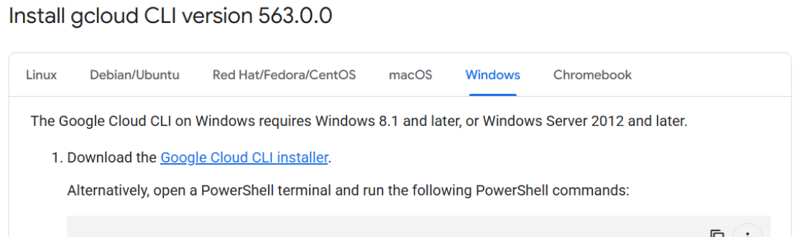
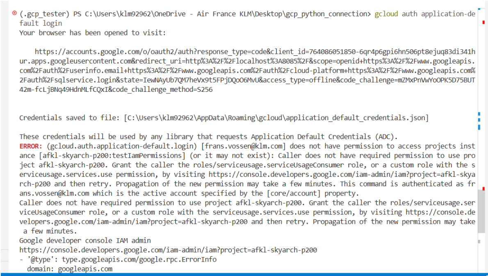
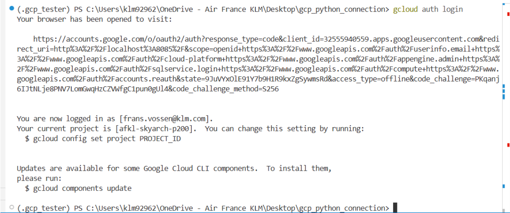

# BigQuery Python Connection Setup Guide

**A Guide to Connect to Google Cloud BigQuery using Python**

This will guide you through:
- Installing required tools and packages
- Setting up authentication
- Running test queries

## 🔧 Step 1: Install gcloud CLI

The Google Cloud CLI is needed for authentication and managing GCP resources. We only need to install this once. After that, we can always call `gcloud ...` in the terminal to authenticate ourselves.


### Windows Installation:
1. Download from: https://cloud.google.com/sdk/docs/install


2. Run `GoogleCloudSDKInstaller.exe`. Leave all default selections.
3. Verify installation in your terminal with
   ```bash
   gcloud --version
   ```

## 🔐 Step 2: Authentication Setup

To access GCP data, we need to authenticate ourselves. We need to do this daily by running 2 gcloud commands. In the background, a personal key is created that lets you connect to GCP. This key expires after some time. To reconnect to GCP, follow again below steps.

### We connect using the approach: Application Default Credentials (ADC)
**STEP 1:** Run the following command in your terminal. This will open a browser where you have to login with your klm account on google. This will create your personal key, but will not yet authenticate you to the data:

   ```bash
   gcloud auth application-default login
   ```

Its normal to get an error. Just ignore.



**STEP 2:** Run the following command in your terminal. This will actually give you the access to the data. This will again open a browser where you again have to login with your klm account on google:

   ```bash
   gcloud auth login
   ```

Now it should not give you an error:



You can close the terminal, and start using data from GCP.

## 📦 Step 3: Install Python Packages

We need to install the following python packages in our .venv:
- `google-cloud-bigquery`
- `db-dtypes`

Add this to your existing virtual environment with:
1. First navigate and activate your virtual environment in the terminal.
2. Then execute:
    ```bash
    uv pip install google-cloud-bigquery db-dtypes
    ```

Alternatively to start fresh from a new virtual environment follow below steps in the terminal:

1. Create new empty virtual environment in current workspace/folder with name `.venv_gcp`
    ```bash
    uv venv .venv_gcp
    ```
2. Activate (navigate to) this .venv_gcp by:
    ```bash
    .venv_gcp\Scripts\activate
    ```
    Now you should see the .venv_gcp in brackets in your terminal:
    
    

3. Install all packages required for this demo:
    ```bash
    uv pip install pandas pyarrow google-cloud-bigquery db-dtypes ipykernel --link-mode=copy
    ```

## Step 4: Go to NoteBook and test the setup
